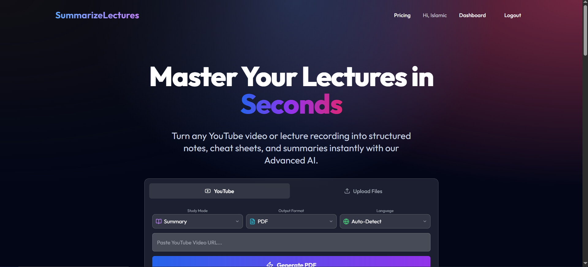
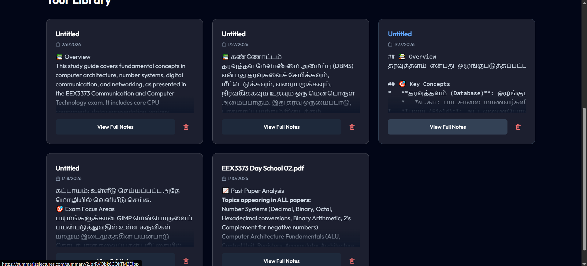
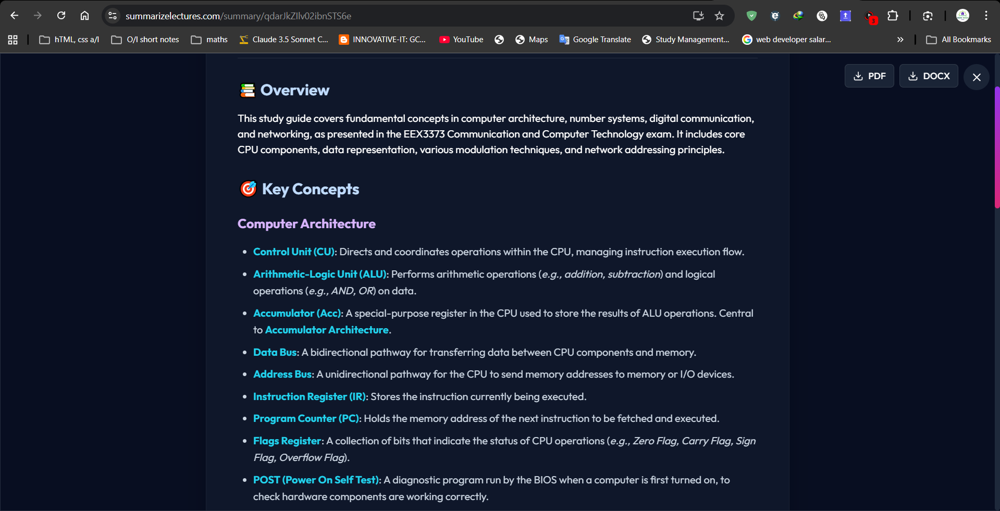

# SummarizeLectures

SummarizeLectures is an AI-powered SaaS that helps students and professionals quickly summarize lectures into clear, structured notes.

## 🌐 Live Website

https://summarizelectures.com/

## 🚀 Features

* AI-powered lecture summarization
* Fast and accurate summaries
* Clean and simple interface
* Works directly in browser
* Saves hours of manual note-taking

## 🖼 Screenshots

### Home Page

### Dashboard

### Summary Result

## 🛠 Tech Stack

* Frontend: JavaScript, HTML, CSS
* Backend: Firebase
* Hosting: Vercel
* AI Integration

## 📌 Purpose of this Repository

This repository is a showcase of the SummarizeLectures SaaS.

Source code is private.

Visit the live product here:
https://summarizelectures.com/

## 👨‍💻 Author

Created by Hassan Musthafa
